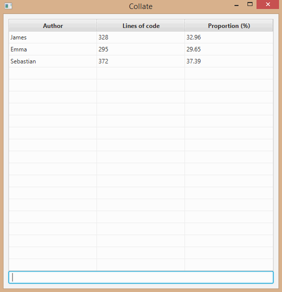

# Collate


Collate is a tool to find out the contributions of the project's authors.

It will export collated files formatted in Markdown. Example collated file: [Sebastian Quek.md](collated/Sebastian Quek.md)

The following section gives a brief overview of how to use Collate. If you'd like to learn more, check out the documentation:
* [Installation Guide](docs/Installation-Guide.md)
* [User Guide](docs/User-Guide.md)
* [Developer Guide](docs/Developer-Guide.md)

## Usage
Include `@@author` tags to the areas of code you wrote.
```java
// @@author John Doe
public class MyCustomPrinter {
    
    private String text;

	public MyCustomPrinter(String text) {
        this.text = text;
	}

    // @@author Jane Doe
    public void print() {
        System.out.println(text);
    }
}
```

Collate works regardless of filetype, as long as the `@@author` tag is supplied.
```css
/* @@author John Doe */
h1 {
    font-size: 3em;
}
```

### Commands:
#### `collate`
* `collate from <DIR>` - Collate all files within `<DIR>` including subfolders
* `collate from <DIR> only` / `collate only from <DIR>` - Only collate files in `<DIR>`
* `collate from <DIR> include java, css` / `collate include java, css from <DIR>`- Only collate java and css files
* `collate from <DIR> only include java` - Only collate java files in `<DIR>`

#### `view`
* `view <AUTHOR'S NAME>` - See author's individual statistics

#### `summary`
* `summary` - See default statistics summary table.

#### `exit`
* `exit` - Exit Collate using the command bar.