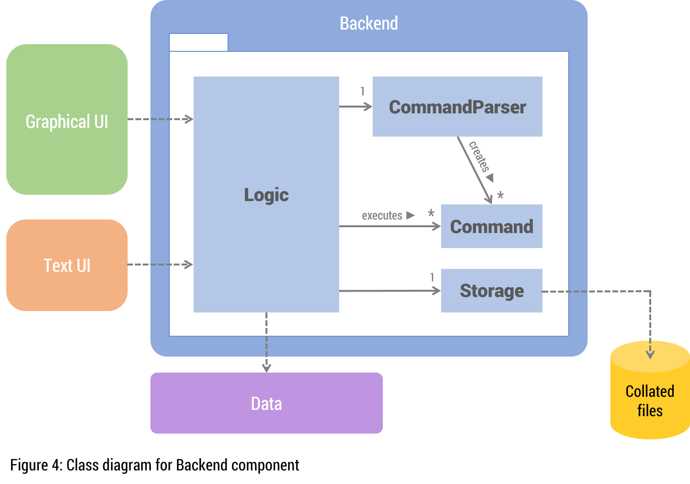

# Introduction
Collate is a simple tool for developers to consolidate the contributions of a project's authors into separate files. It is Java application that utilises JavaFX for its Graphical User Interface (GUI).

This guide describes the design and implementation of Collate. It will help you understand how Collate works and how you can further contribute to its development. I have organised this guide in a top-down manner so that you can understand the big picture before moving on to the more detailed sections.

# Architecture


Collate is made up for five main components. Users can either use Collate through the GUI or Text UI (TUI) components.

1) The GUI component consists of JavaFX's FXML files which define the layout that users interact with and the Java files which control these FXML files.

2) The TUI component is an alternative of the GUI component. Users can enter commands through the command line interface (CLI),

2) The Backend component contains all the logic needed to parse users' commands, store collated data into individual files, etc.

3) The Data component represent data objects such as the authors of the project and code snippets that were written.

4) The Test Driver component utilises JUnit for unit testing.

# GUI Component


The GUI component is made up of two packages, `gui` and `view`. The `gui` package contains the Java files that control what users see while the `view` package contains JavaFX's `fxml` files that describe how to layout JavaFX components.
A `stylesheet.css` is also found in the `view` package. This stylesheet customises the appearance and style of JavaFX components.

Users will enter commands through the `CommandBarController`, which then passes these commands to the `MainApp`. `MainApp` will then call `Logic` in the `backend` package to handle the actual execution of these commands.

`MainApp` is then responsible for displaying the correct view to update what the user sees. Collate has two views, a `Summary` view and `FileStats` view which are controlled by their corresponding controller classes. These classes will be elaborated upon in the following sections.

## MainApp Class
The `MainApp` class is the main driver for the GUI component. It controls what users see and handles user inputs by passing them to the `backend` package.

`MainApp` extends from JavaFX's `Application` class and overrides its `start` method. This method is the starting point of the whole application and very importantly, initialises all the components that are required for the GUI. This method facilitates the loading of `RootLayout.fxml` from the `view` package.

The `start` method then calls `initPrimaryStage(Stage)` as seen below. This method creates a new JavaFX `Scene` using this `RootLayout` and sets the main `Stage` to show this scene.

###### Code snippet from MainApp.java
``` java
private void initPrimaryStage(Stage primaryStage) {
    this.primaryStage = primaryStage;
    this.primaryStage.setTitle(WINDOW_TITLE);
    this.primaryStage.setScene(new Scene(rootLayout));
    this.primaryStage.show();
}
```

When a user presses any key, `MainApp` receives this information and decides what to do with them. The current implementation listens for the enter key which implies that the user has entered a command and would like for it to be executed.

> This implementation allows Collate to be extended to listen for other keystrokes such as `tab`, `space`, etc.

## CommandBarController Class
## SummaryController Class
## FileStatsController Class
### FileStatsItem Class

# TUI component

# Backend Component

## Logic Class
## CommandParser Class
### Command Class
## Storage Class

# Data Component

## Author Class
## CodeSnippet Class
## SourceFile Class

# Test Driver Component
