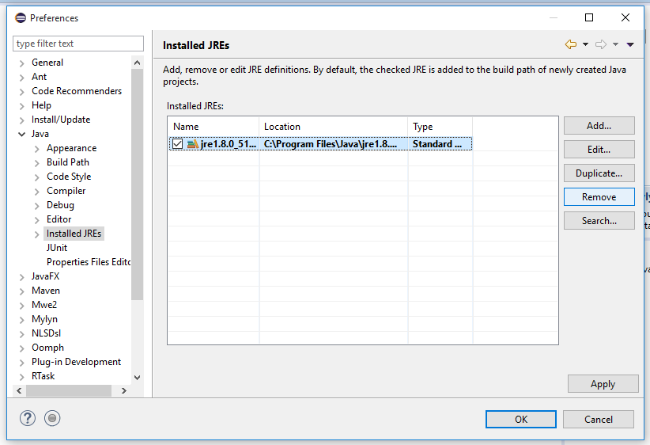
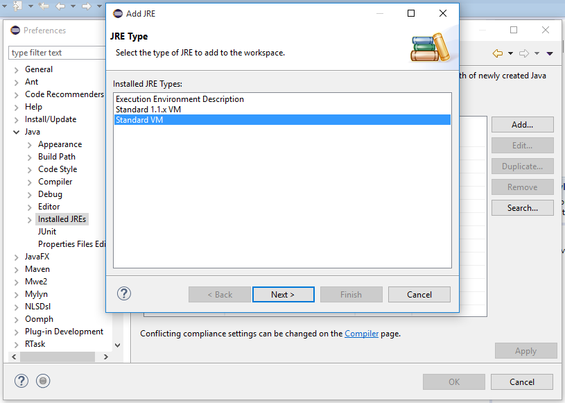
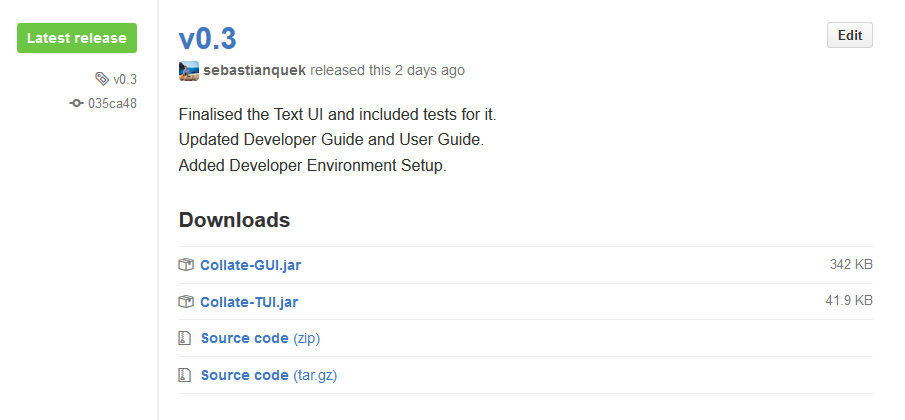
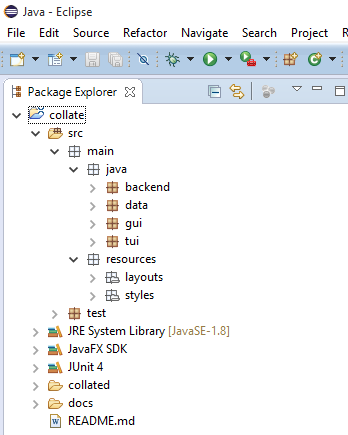
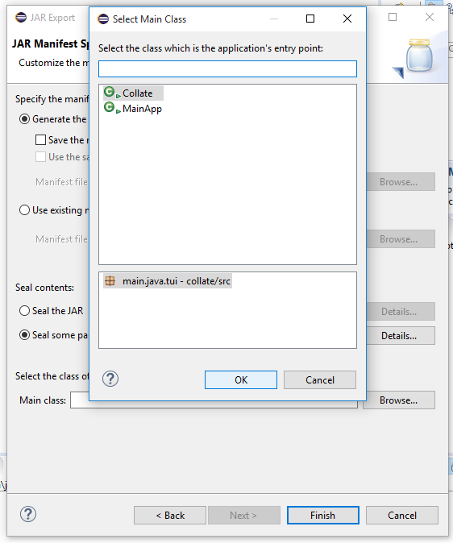
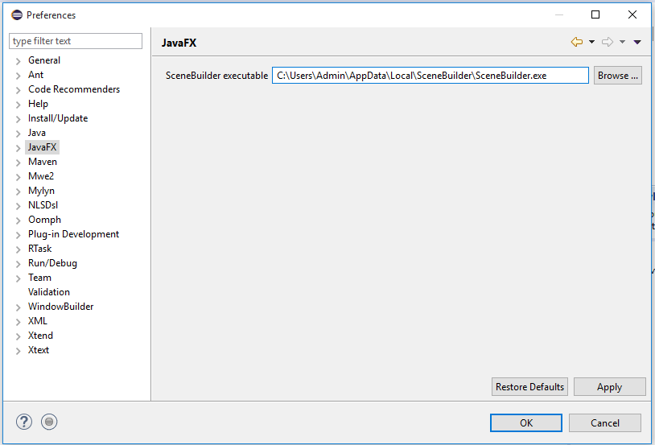
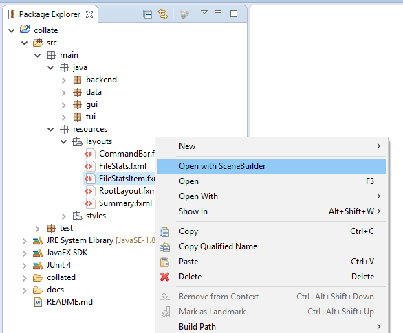
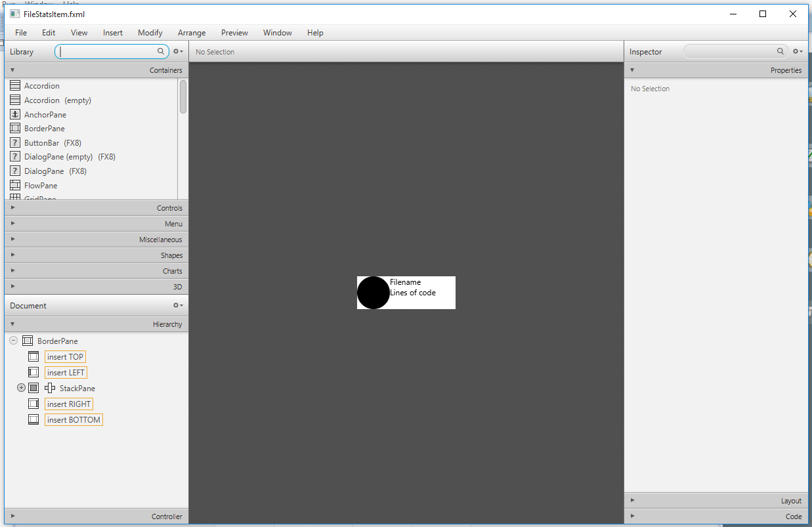
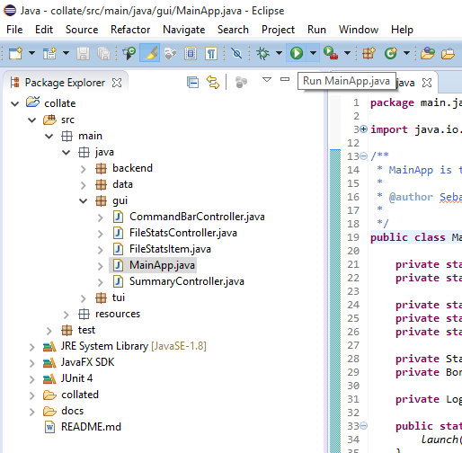
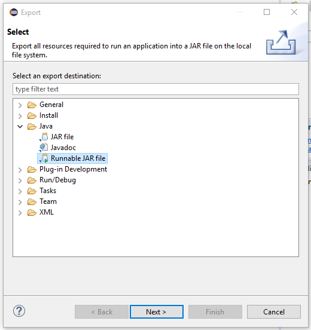

# Development Environment Setup
This guide aims to help you set up Collate, edit its source code and export it as `.jar` files.

If you want to run the GUI version of Collate, follow the guide to set up the Text UI version before moving 
on to the setup of the GUI version.

<!-- MarkdownTOC -->

- [Setup Text UI version of Collate](#setup-text-ui-version-of-collate)
    - [Setup development environment](#setup-development-environment)
        - [JDK 8u40 or later](#jdk-8u40-or-later)
        - [Eclipse Luna or later](#eclipse-luna-or-later)
        - [e(fx)clipse 1.2.0 or later](#efxclipse-120-or-later)
    - [Configure development environment](#configure-development-environment)
        - [Set Java JDK](#set-java-jdk)
    - [Import and run Collate](#import-and-run-collate)
        - [Download the latest release](#download-the-latest-release)
        - [Import project into Eclipse](#import-project-into-eclipse)
        - [Run Collate](#run-collate)
    - [Export Collate](#export-collate)
        - [Run exported jar](#run-exported-jar)
- [Setup GUI version of Collate](#setup-gui-version-of-collate)
    - [Setup development environment](#setup-development-environment-1)
        - [Scene Builder 8.0.0 or later](#scene-builder-800-or-later)
    - [Configure development environment](#configure-development-environment-1)
        - [Set SceneBuilder executable](#set-scenebuilder-executable)
    - [Edit and run Collate](#edit-and-run-collate)
        - [Edit `.fxml` files](#edit-fxml-files)
        - [Run Collate](#run-collate-1)
    - [Export Collate](#export-collate-1)
        - [Run exported jar](#run-exported-jar-1)

<!-- /MarkdownTOC -->

# Setup Text UI version of Collate

## Setup development environment

### JDK 8u40 or later

http://www.oracle.com/technetwork/java/javase/downloads/index.html

1. Click JDK download
2. Accept the license agreement and download the appropriate installation file

### Eclipse Luna or later

> Eclipse is the IDE that was used to develop Collate.

https://www.eclipse.org/downloads/

1. Download "Eclipse IDE for Java Developers"
2. Extract the contents to whichever directory you want. E.g. C:/eclipse

### e(fx)clipse 1.2.0 or later 

> e(fx)clipse enables you to create new JavaFX FXML projects using Eclipse and start Scene Builder from
 within the IDE.

http://www.eclipse.org/efxclipse/install.html

Follow the installation instructions in the link above.

## Configure development environment

### Set Java JDK

1. In Preferences window, go to Java > Installed JREs
2. Remove the existing entries

3. Click Add...
4. Select Standard VM and click Next

5. Navigate to the directory of your installed JDK

6. Click Finish
7. Tick the checkbox beside this entry and click Apply

8. Go to Java > Compiler and ensure the Compiler compliance level is at least 1.8

## Import and run Collate

### Download the latest release

1. Navigate to https://github.com/collate/collate/releases
2. Download and extract the source code of the latest release

### Import project into Eclipse

1. In Eclipse, go to File > Import...
2. Select General > Existing Projects into Workspace and click Next
3. Select root directory of the extracted source code and click Finish.

> The default view of the Package Explorer shows the packages in a flat manner. If you want to see packages 
in a hierarchical manner, click on the downward pointing triangle and change the Package Presentation.

### Run Collate

1. Open `Collate.java` from the `tui` package
2. Click Run `Collate.java`

## Export Collate

1. File > Export...
2. Select Java > JAR file
3. Select the src file to be exported and set the export destination

4. Click Next 2 times
5. Set the Main class
6. Click Finish

### Run exported jar
1. Open a command window/terminal in the directory of the jar file

> For Windows, Shift+Right click in the directory of the jar file and click open command window here.

2. Enter `java -jar collate-tui.jar` (replace the filename accordingly)

# Setup GUI version of Collate

## Setup development environment
Follow the setup instructions for the TUI version before moving on.

### Scene Builder 8.0.0 or later

> Scene Builder enables you to arrange components in JavaFX layouts through a GUI.

http://gluonhq.com/open-source/scene-builder/

Download and *install* Scene Builder using the link above. Do not download the executable jar as it will 
not work when attempting to open Scene Builder from Eclipse.

## Configure development environment
Follow the configuration instructions for the TUI version before moving on.

### Set SceneBuilder executable

1. Go to Window > Preferences
2. Click on JavaFX tab
3. Find the SceneBuilder executable. For Windows, it can be 
found here: `C:\Users\<USER>\AppData\Local\SceneBuilder\SceneBuilder.exe`
4. Click Apply

## Edit and run Collate
If you're unsure how to import Collate, .

### Edit `.fxml` files

> e(fx)clipse enables you to edit `.fxml` files using Scene Builder through Eclipse.

1. Right click on the `.fxml` file and click Open with SceneBuilder.

2. After you have saved your edits, refresh the project to ensure the latest `.fxml` files are used.

### Run Collate

1. Open `MainApp.java` from the `gui` package
2. Click Run `MainApp.java`

## Export Collate

1. File > Export...
2. Select Java > Runnable JAR file

3. Select MainApp as the Launch configuration
4. Set Export destination
5. Ensure "Package required libraries into generated JAR" is selected
6. Click Finish

### Run exported jar

For the GUI version, simply double click on the jar file.