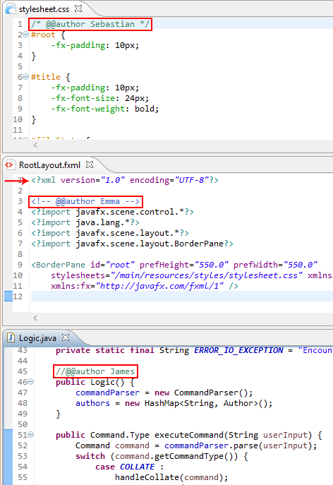
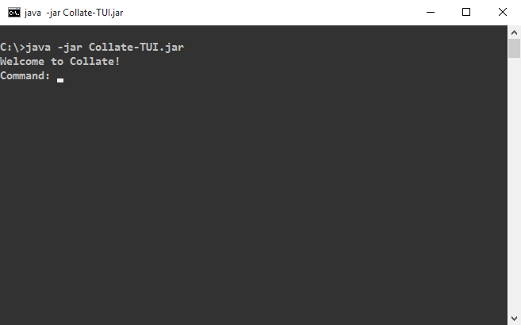
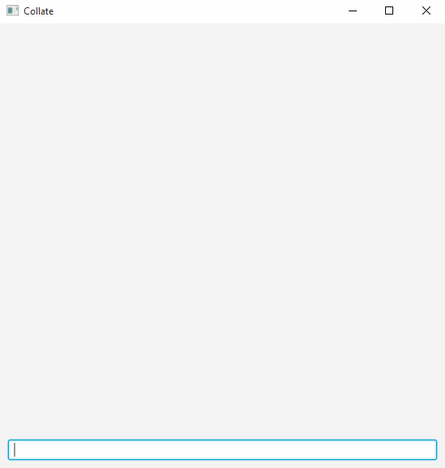
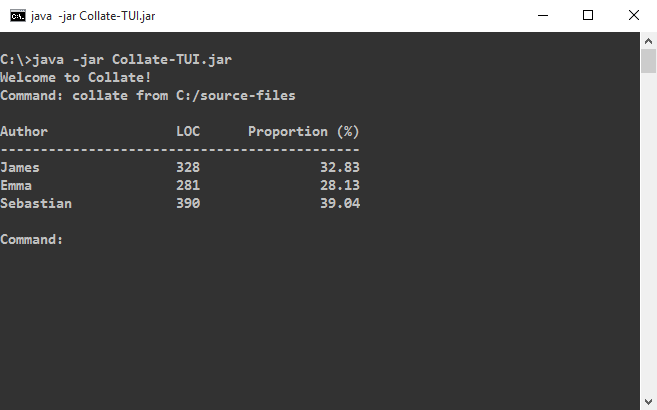
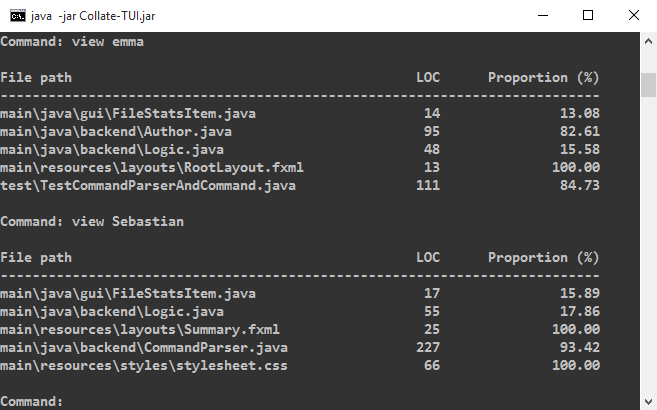

# About
Now that you know what Collate is [about](../README.md), you can follow this guide to learn how to use Collate effectively.

# Table of Contents
<!-- MarkdownTOC -->

- [Quick Start Guide](#quick-start-guide)
- [Feature Walkthrough](#feature-walkthrough)
    - [Getting Started](#getting-started)
    - [Using Collate](#using-collate)
        - [Collate files](#collate-files)
        - [View an author's statistics](#view-an-authors-statistics)
        - [Summary](#summary)
        - [Exit](#exit)
- [Cheatsheet](#cheatsheet)

<!-- /MarkdownTOC -->

# Quick Start Guide
Include `@@author` tags to the areas of code you wrote.
```java
// @@author John Doe
public class MyCustomPrinter {
    
    private String text;

    public MyCustomPrinter(String text) {
        this.text = text;
    }

    // @@author Jane Doe
    public void print() {
        System.out.println(text);
    }
}
```

Before you can use Collate, you need to install JDK 8u40 or later. You can get it here: http://www.oracle.com/technetwork/java/javase/downloads/index.html

There are two variants of Collate, one has a graphical user interface (`Collate-GUI.jar`) while the other has a text-based user interface (`Collate-TUI.jar`).

You can then download `Collate-GUI.jar` or `Collate-TUI.jar` from the latest release here: https://github.com/collate/collate/releases

*To open the graphical user interface version*, simply double-click on the `Collate-GUI.jar` file to start Collate. You will be greeted with a simple interface that has a command bar. This command bar is where you enter short commands to tell Collate what to do.

*To open the text-based user interface version*, open a command window in the same folder as `Collate-TUI.jar` and enter `java -jar Collate-TUI.jar`. You can then enter commands within the command window.

Below are some commands to get you started.
* `collate from <FOLDER>` - Collate all files within `<FOLDER>` including subfolders
* `view <AUTHOR'S NAME>` - See author's individual statistics
* `summary` - See the default statistics summary table
* `exit` - Exit Collate using the command bar

# Feature Walkthrough
## Getting Started
Using the `@@author` tag, you can specify the lines of code that you have written. Lines between your author tag and the next author tag will be marked as yours. Your name can include letters and numbers.
> Make sure to use the same name so that the code you wrote will be saved correctly in a single file.

You can include any type of file, as long as the `@@author` tag is present.



You can also enter an author tag without a name to explicitly tell Collate that code you wrote ends at this tag.
> This also makes it easier for other authors to mark that area of code as theirs.


## Using Collate
This section will walk you through the various commands that Collate has to offer. These commands are the same for both variants of Collate. Animated screenshots are also shown to demonstrate and illustrate the differences in the user interface of the two variants.

### Collate files
##### All subfolders
So you have marked the areas of code that you wrote. To collate them, simply enter the following command with the location of your source files.

`collate from <FOLDER>`

> The `from` option tells Collate where to look for your source files.




If your folder includes whitespaces, you will need to surround the folder with double inverted commas. For example, `collate from "C:/source files"`.

##### Only the specified folder
If you would like to collate files only from the specified folder, and not files from subfolders, you can add the `only` option.

`collate from <FOLDER> only` or `collate only from <FOLDER>`

> Collate allows for flexible input options. You need not worry about the position of these options, just remember to start each command with the `collate` keyword.

##### Only certain types of files
Collate scans the folder you specified for all types of file. What if you want to collate only `java` files? Well, you can use the `include` option.

`collate from <FOLDER> include java`

You can include multiple filetypes by separating them with commas.

`collate from <FOLDER> include java, css, fxml`

### View an author's statistics
Viewing an author's contribution statistics can be done by entering the following command.

`view <AUTHOR's NAME>`

> To make using Collate easier, the author's name is not case-sensitive.

This view allows you to see the proportion and number of lines of code the author wrote for files he/she contributed to.




### Summary
The summary view is the default screen that shows you the contributions of all authors. To access it, simply enter the following.

`summary`




### Exit
The following command allows you to exit Collate through the command bar.

`exit`

# Cheatsheet
Command | Description
--------| ------------
`collate from <FOLDER>` | Collate all files within `<FOLDER>` including subfolders
`collate from <FOLDER> only` | Collate files in `<FOLDER>` only
`collate from <FOLDER> include <FILETYPE1>, <FILETYPE2>` | Collate `<FILETYPE1>` and `<FILETYPE2>` files in `<FOLDER>` and its subfolders
`collate from <FOLDER> only include <FILETYPE1>` | Collate `<FILETYPE1>` files in `<FOLDER>` only
`view <AUTHOR'S NAME>` | See author's individual statistics
`summary` | See default statistics summary table
`exit` | Exit Collate