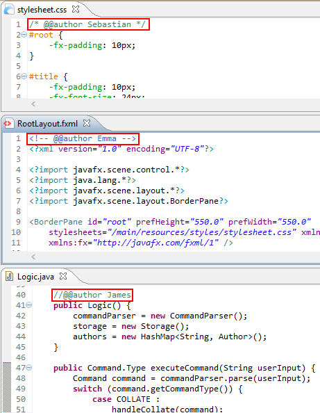
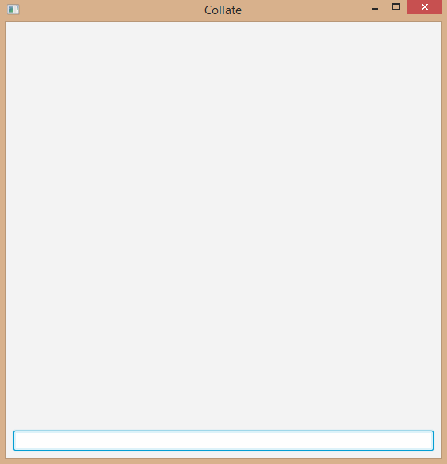
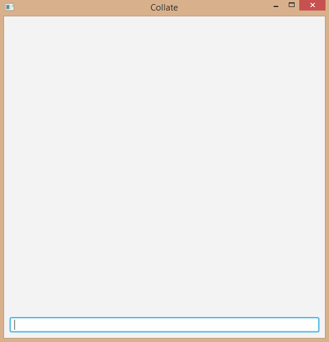
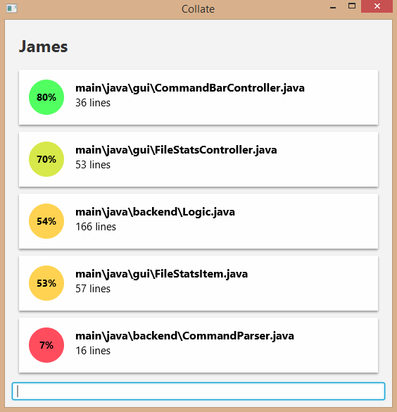

# About
Have you ever wanted to collate all your contributions to a project and see them in an easily readable file? How about comparing your contributions with other authors of a project?

Collate does all that and more! It is a simple tool that will scan a directory to find and collate parts of the code that you wrote. On top of being able to see everyone's overall contributions to the project, you can see the proportion of code an author wrote for files he/she contributed to.

This guide will illustrate how to use Collate effectively.

# Getting Started
The first thing that you need to do before you can collate any source code is to demarcate the lines that you wrote.

Using the `@@author` tag, you can specify the lines of code that you have written. Lines between your author tag and the next author tag will be marked as yours. Your name can include letters and numbers.
> Make sure to use the same name so that the code you wrote will be saved correctly in a single file.

You can also enter an author tag without a name to explicitly tell Collate that code you wrote ends at this tag.
> This also makes it easier for other authors to mark that area of code as theirs.

You can include any type of file, as long as the `@@author` tag is present.

# Using Collate
## Launch
Simply double-click on the `Collate.jar` file to start Collate.
You will be greeted with a simple interface that has a command bar. This command bar is where you enter short commands to tell Collate what to do.

## Collate files
#### All subfolders
So you have marked the areas of code that you wrote. To collate them, simply enter the following command with the location of your source files.

`collate from <FOLDER>`

> The `from` option tells Collate where to look for your source files.

If your directory includes whitespaces, you will need to surround the directory with double inverted commas.

#### Only the specified folder
If you would like to collate files only from the specified folder, and not files from subfolders, you can add the `only` option.

`collate from <FOLDER> only` or `collate only from <FOLDER>`

> Collate allows for flexible input options. You need not worry about the position of these options, just remember to start each command with the `collate` keyword.

#### Only certain types of files
Collate scans the folder you specified for all types of file. What if you want to collate only `java` files? Well, you can use the `include` option.

`collate from <FOLDER> include java`

You can include multiple filetypes by separating them with commas.

`collate from <FOLDER> include java, css, fxml`

## View an author's statistics
Viewing an author's contribution statistics can be done by entering the following command.

`view <AUTHOR's NAME>`

> To make using Collate easier, the author's name is not case-sensitive.

This view allows you to see the proportion and number of lines of code the author wrote for files he/she contributed to.

## Summary
The summary view is the default screen that shows you the contributions of all authors. To access it, simply enter the following.

`summary`

## Exit
The following command allows you to exit Collate through the command bar.

`exit`